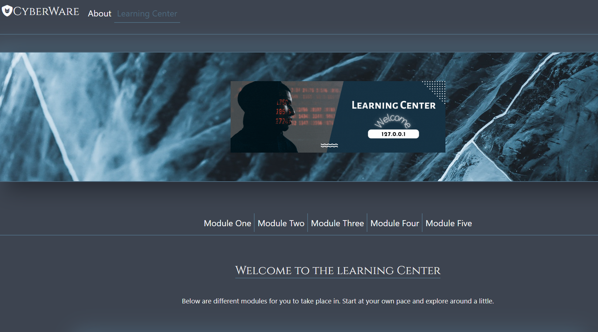

# CyberPunk
 

## Table of Contents
* [Description](#description)
* [Installation](#installation)
* [Usage](#usage)
 * [Contributors](#contributors)
 * [Site](#site)

# Description
-Our website is designed with education in mind and we hope you will enjoy the different activies we have set up for you to explore a few topics in cyber security. We created this website with intentions to help educate users that may not know much about a topic or set of topics. As the internet and technology continues to grow, there is an ever growing importance of protecting data. It is crutical because it helps to protect organizations and individuals from cyber attacks. Taking the time to learn more could be the difference, Start now

# Installation
In order to install the project you will need the following: 
- Git
- IDE with node.js capabilities 

To start: 
Clone the repository on GitHub then open Git on your local machine. First find a location of your choice on your computer that you want the folder to be in.
- To change working directory, use the command cd followed by a folder or cd.. to move back  
- Using the command git clone and adding the cloned directory, you will have a copy of this project

# Usage 
The purpose behind this project was to provide a platform for students and those alike to learn about different aspects of computer security in a fun and interactive website.    

# Contributors
- WixkedLuck

# Site
Deployed Link: 
https://wixkedluck.github.io/CyberWare/

